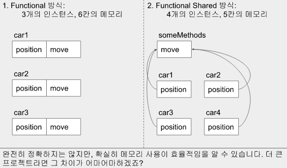
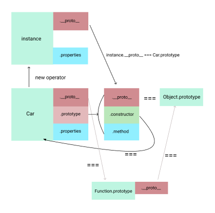
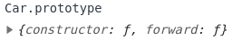

[OOP 참고 medium](https://levelup.gitconnected.com/object-oriented-javascript-da4a24b80a7f)

# 1. What is OOP?
## Object-Oriented Programming
- 일종의 프로그래밍 설계 원칙.
    - 어떤 설계? 속성과 기능을 사전에 정의해두고, 필요할 때마다 그러한 속성과 기능을 따르는 인스턴스를 만들어 사용가능.

- 이를 가능케 하는 것이 class.
    - 따라서 class = 'property(속성) + method(기능)'으로 구성됨.

- 다음과 같은 특징이 있음
    - 인스턴스끼리 개별로 존재할 수 있음: 캡슐화가 잘되어 있다.
    - 하나의 클래스는 다른 클래스의 특징을 가져올 수 있음: 상속가능
    - 겉으로 보이는 기능과 내부에서 실제로 작동하는 로직간에 차이가 큼: 추상화
    - 하나의 인스턴스가 여기저기 상속받아서 다양한 모습을 가질 수 있음: 다형성

# 2. How to define a Class?
## 2.1 Pesudoclassical한 구현
### pesudo-(1) Functional
- 일종의 someInstance라는 object를 생성하는 방식.

```js
var Car = function(owner){
  var someInstance = {};
  someInstance.owner = owner;
  someInstance.position = 0;
  someInstance.move = function(){
    this.position += 1;
  }
  return someInstance; // 함수를 실행했을 때, 찍어낼 객체
}
var car1 = Car(seob);
```

### pesudo-(2) Functional Shared
- 사실상 pesudo-(1)과 동일한 것.  
  - 다만, 바깥에 존재하는 함수를 아래 extend를 통해 사후적으로 객체에 통합하는 방식.

```js
var someMethods = {}; 
someMethods.move = function(){
  this.position += 1;
};
var extend = function(to, from){
  for(var key in from){
    to[key] = from[key];
  }
};
var Car = function(owner){
  var someInstance = {position:0}
  someInstance.owner = owner;
  extend(someInstance, someMethods);  // 메모리 주소를 내부에서 할당하는 방식.
  return someInstance;
};
var car1 = Car(seob);
```

- pesudo-(1)과 비교할 때, pesudo-(2)의 장점?
  - pesudo-(1)방식은 인스턴스가 생성될 때 마다 모든 메서드를 만들어 주기 때문에, 메모리를 많이 차지하게 됨.
  - 반면, fucntional shcared 방식을 사용하면, 객체에 있는 메모리 주소만을 참조하기 때문에 효율이 좋아짐.



</br>

### pesudo-(3) Prototypal
- pesudo-(2)의 `extend`대신, `Object.create(someMethods)`를 이용해 외부의 메소드를 내부로 가져오는 방식이다.
  - [Object.create()](https://developer.mozilla.org/ko/docs/Web/JavaScript/Reference/Global_Objects/Object/create)란, 특정 객체를 프로토타입으로 하는 객체를 생성해주는 함수이다.

```js
var someMethods = {}; 
someMethods.move = function(){
  this.position += 1;
};
var Car = function(owner){
  var someInstance = Object.create(someMethods) //object.create에 대해서는 상속에서 자세히 다룸.
  someInstance.position = 0;
  someInstance.owner = owner;
  return someInstance;
};
var car1 = Car(seob);
```

### pesudo-(4) Pesudoclassical
- pesudo-(2)와 (3)은 바깥에 있는 함수를 가져와 객체의 메서드로 사용하는 경우라면, (4)는 아에 객체의 메서드를 바깥에서 만든 것.

```js
var Car = function(position){
  this.position = position;
};
Car.prototype.move = funciton(){
  this.position += 1;
};
var car1 = new Car(1);
```

## 2.2 ES6의 Class (OOP)
- class로 property와 method가 함께 묶여 있다.
 

```js
class Car{
  constructor(position){
    this.position = positon;
  };
  move(){
    this.position += 1;
  };
};
```

# 3. How to do inheritance?

## 3.1 Pesudoclassical Inheritance

```js
var Car = function(position){
  this.position = position;
};
Car.prototype.forward = function(){
  this.position ++;
};
function Truck(position){
  Car.call(this, position); // 3. this.postion이 undefined가 되기 때문에, this를 지정해줄 필요가 있음.
  this.size = 10;
}
Truck.prototype.sizeup = function(){
  this.size ++;
}
// 상속하려면 이 두개
Truck.prototype = Object.create(Car.prototype); // 1. 이렇게하면 truck1.__proto__가 Car의 생성자가 나옴. 
Truck.prototype.constructor = Truck; // 2. truck1.__proto__가 Truck의 생성자가 나올 수 있도록 바꿔줘야함.
```

### (1) Truck.prototype = Object.create(Car.prototype)


- 하지만, 인스턴스.\_\_proto__ 가 Truck이 아닌 Car이 나옴

### (2) Truck.prototype.constructor = Truck;
- 이렇게 하면, \_\_proto__에 Truck이 제대로 나옴.
- 하지만 여전히 Car의 property인 this.position에 접근할 수 없음.

### (3) function Truck안에 Car.call(this. position) 
- 이렇게 하면, this를 Truck으로 지정해주기 때문에, 생성자 전달 문제가 해결.
  - call대신, apply사용도 가능


## 3.2 ES6 Inheritance

### (1) extend
- pesudoclassical의 (1), (2)는 Truck class뒤에 extend를 붙이는 것으로 해결.

### (2) super
- pesudoclassical (3)의 생성자 전달 문제는 super(input)으로 해결.

```js
class Car{
  constructor(position){
    this.position = position
  };
  forward(){
    this.position ++;
  };
};
class Truck extends Car{
  constructor(position){
    super(position);
  }
  size(){
    this.size ++;
  }
}
```
& Object.create()
# 4. Understanding prototype chain

- \_\_proto__ 의 구조 ([refernece](http://dmitrysoshnikov.com/ecmascript/javascript-the-core/#scope-chain))


위 그림에 따르면,
- Car.protytype === Car.prototype.constructor.prototype
- Car.prototype.constructor === Car


## 4.1 함수를 정의할 때 발생하는 일

### (1) Prototpe 객체 생성 및 연결

- 함수에 prototype이라는 객체를 생성함.

### (2) 함수에 constructor 자격 부여
- prototype객체 안에는 constructor가 있는데, 이는 다시 함수 자체를 연결시킴.
  - constructor이 있으면, new를 통해 객체를 생성할 수 있게 됨.


## 4.2 프로토타입 체인(__proto__)

Car.prototype을 보면, \_\_proto__라는게 있는데, 무슨 역할?
- \_\_proto__는 객체가 생성될 때 조상인 Prototype Object를 가리킴.
  - 만일, Car에서 찾고자 하는 property를 못찾게 된다면, \_\_proto__를 통해 상위 객체로 이동해서 property를 찾음. 
  - 이러한 원리를 이용해 상속이 가능.

[참고자료](https://medium.com/@bluesh55/javascript-prototype-%EC%9D%B4%ED%95%B4%ED%95%98%EA%B8%B0-f8e67c286b67)

